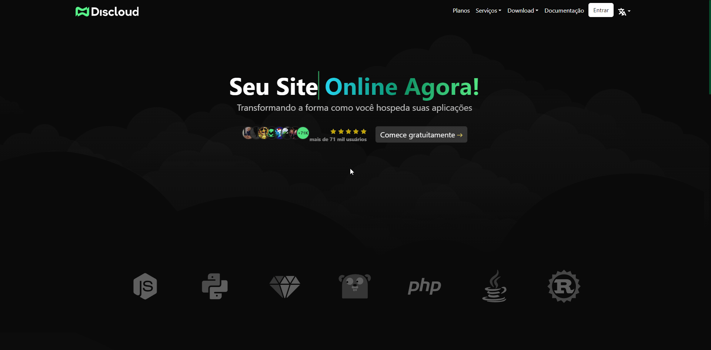
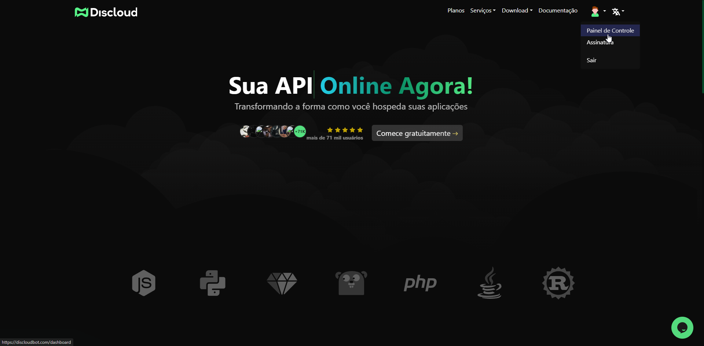

import { Card, CardGrid } from "@astrojs/starlight/components";

## 👤 Registro no Site

Antes de começar, é necessário criar uma conta em nosso site. Acesse [**Discloud**](https://discloudbot.com/), clique em "Entrar" e faça login com suas credenciais.

:::warning
Atualmente o registro com o GitHub está desativado, use o Discord.
:::

## 🖥️ Acessando o Painel de Controle

Para acessar o painel de controle, clique na imagem do seu perfil no canto superior direito e em seguida em "Painel de Controle".

## 🔗 Diferentes Opções Para Hospedar

### 🤖 Aplicações

<CardGrid stagger>
  <Card title="Dashboard" icon="pencil">
    Edit `src/content/docs/index.mdx` to see this page change.
  </Card>
  <Card title="Add new content" icon="add-document">
    Add Markdown or MDX files to `src/content/docs` to create new pages.
  </Card>
  <Card title="Configure your site" icon="setting">
    Edit your `sidebar` and other config in `astro.config.mjs`.
  </Card>
  <Card title="Read the docs" icon="open-book">
    Learn more in [the Starlight Docs](https://starlight.astro.build/).
  </Card>
</CardGrid>

  <a class="card" href="aplicacoes/dashboard.md">
    

      <h3>Dashboard</h3>
    

  </a>
  <a class="card" href="aplicacoes/discord.md">
    

      <h3>Discord</h3>
    

  </a>
  <a class="card" href="aplicacoes/vscode.md">
    

      <h3>VSCode</h3>
    

  </a>
  <a class="card" href="aplicacoes/cli.md">
    

      <h3>CLI</h3>
    

  </a>

### 🌎 Sites & APIs

  <a class="card" href="sites-e-apis/dashboard.md">
    

      <h3>Dashboard</h3>
    

  </a>
  <a class="card" href="sites-e-apis/discord.md">
    

      <h3>Discord</h3>
    

  </a>
  <a class="card" href="sites-e-apis/vscode.md">
    

      <h3>VSCode</h3>
    

  </a>
  <a class="card" href="sites-e-apis/cli.md">
    

      <h3>CLI</h3>
    

  </a>

